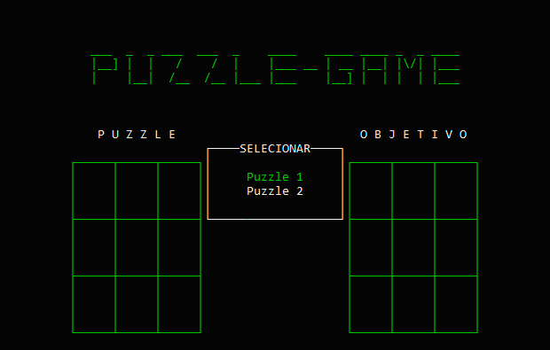

# The project

A number arrange puzzle game written in C initially developed to a university project from my course.
The game itself is in portuguese language.

# The game

You can beat an number arrange puzzle game by shuffling the numbers into the right order.

# Install instructions

## Common users
1. Go to releases tab 
2. Download the Number-arrange-game.exe file 
3. Run it 
4. Have fun! :)

## Pro users
1. Clone or download zip our project via github 
2. Open a terminal/cmd window in "src" folder 
3. Compile the "main.c" using an installed compiler which suportts C++ 
4. At the same folder, run the compiled file using "./name-of-compiled-file.exe" in your terminal/cmd

# In-game instructions

1. Select your desired puzzle option on main menu by pressing enter 
2. Use the keyboard arrows to select the position you want to move and press enter 
3. Pressing ESC, you can pause the game and restart it or show the puzzle solution

# Developers

Erick M. L. Pacheco 
Leonardo Sanavio